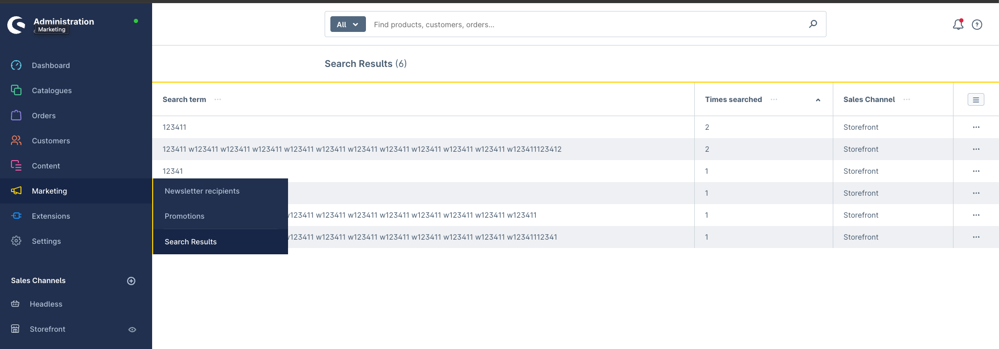

# Sidworks SearchResults for Shopware 6
Simple plugin that adds a list with search results to analyze for marketing purposes

## Images


## Installation
```bash
composer require sidworks/sw-plugin-search-results
bin/console plugin:refresh
bin/console plugin:install --activate SidworksSearchResults
```

## TODO
- Add amount of search results to search term
- Make filter work
  - Sales Channels
  - Date
- Add configuration for minimum times searched
